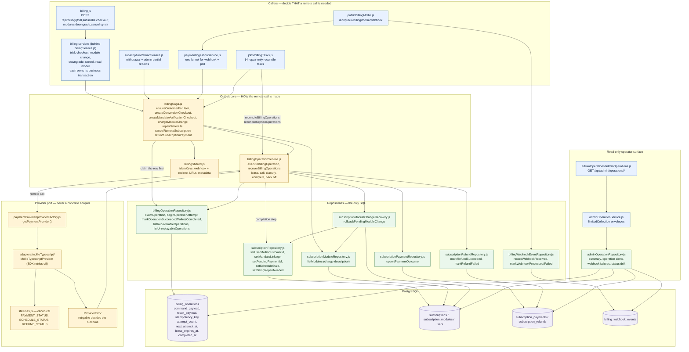
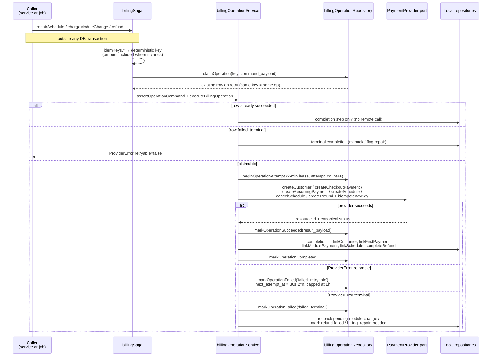

# Anatomy of a billing operation

Every remote payment-provider mutation — create a customer, open a checkout,
charge a mandate, create or cancel a schedule, refund a payment — is a **billing
operation**: a row in `billing_operations` committed *before* the provider is
called, carrying a versioned command, an idempotency key and an idempotent local
completion step.

This page is the structural companion to [`lifecycle.md`](lifecycle.md): where
that one describes *when* the system charges, this one shows *which services and
repositories* carry that charge out, and who repairs it when a step is lost.

## The layers

The shape to remember: **callers decide, the saga describes, the operation
service executes, repositories persist.** A caller never imports an adapter and
never touches `billing_operations`; the operation service never decides business
policy — it only runs the stored command and applies the stored completion.

## One operation, step by step

Two crash windows exist, and the same repair covers both. If the process dies
**before or during** the remote call, the lease expires and the row is still
`pending`/`failed_retryable`. If it dies **after** provider success but **before**
the local completion, the row is `succeeded` with `completed_at IS NULL`.
`listRecoverableOperations` selects exactly those two shapes, and
`reconcileBillingOperations` re-runs `executeBillingOperation`, which skips the
provider call it already made.

## Who owns what

| Module | Kind | Responsibility |
| --- | --- | --- |
| `billingService.js` | facade | Aggregate re-export of the services below — the `/api/billing` surface. No logic lives here. |
| `subscriptionTrialService.js` | service | Starting the 30-day trial. |
| `subscriptionCheckoutService.js` | service | Direct signup and the priced conversion checkout. |
| `moduleChangeService.js` | service | Adding a module or moving one up: quote, proration, activate-first charge. |
| `moduleDowngradeService.js` | service | Lowering or removing a module: consent, manifest freeze, boundary scheduling. |
| `subscriptionCancelService.js` | service | Cancel at period end and resume (the immediate refund path lives in the refund service). |
| `billingReadService.js` | service | The `/billing` read model, the subscription serializer, and the manual sync. |
| `moduleCapacityService.js` | service | Capacity blockers: current usage across a ladder's tenants against a target plan's limits, under the growth-write lock set. |
| `billingPostCommit.js` | helper | The post-commit "reprice, then repair the provider schedule" step every billing write ends with. |
| `billingErrors.js` | helper | The expected-failure constants shared across those services. |
| `subscriptionRefundService.js` | service | Commits the refund intent locally, then refunds through the outbox; owns the withdrawal window and the over-refund `SUM` guard. |
| `paymentIngestionService.js` | service | The single funnel for webhook + poll outcomes; requests a schedule repair once a charge is authoritative. |
| `jobs/billingTasks.js` | job | Repair-only. `billing_operations` recovers work, `orphan_operations` warns about pre-migration rows with no stored command. |
| `billingSaga.js` | service | Builds the provider-neutral command and its completion, claims the outbox row, and delegates execution. Never runs inside a DB transaction. |
| `billingOperationService.js` | service | Lease, provider dispatch, error classification, backoff, and the idempotent completion step. |
| `billingShared.js` | helper | `idemKeys`, webhook/redirect URLs, metadata, period maths — the deterministic inputs an operation key depends on. |
| `billingOperationRepository.js` | repository | All `billing_operations` SQL: claim, lease, mark, recover. |
| `subscriptionRepository.js` | repository | Narrow single-column linkage updates the completion step writes (customer id, mandate, schedule staleness, repair flag). |
| `subscriptionPaymentRepository.js` | repository | `upsertPaymentOutcome` for the charge an operation opened. |
| `subscriptionRefundRepository.js` | repository | Flips the refund intent to succeeded/failed. |
| `subscriptionModuleChangeRecovery.js` | service | Rolls back a pending module change when its prorated charge terminally fails. |
| `billingWebhookEventRepository.js` | repository | Durable webhook-delivery audit — provider ids and normalized codes only. |
| `admin/operations/*` | route → service → repository | Read-only operator views over local state. Opening a dashboard never calls the provider. |

## Invariants this structure exists to protect

1. **Never a provider call inside a DB transaction.** Local state commits first;
   the remote call happens after, through the outbox.
2. **The row is committed before the call.** A crash can never lose the fact
   that money may have moved.
3. **The idempotency key is deterministic and reused on every attempt** — and it
   includes the amount wherever the amount can differ, so two differently-priced
   charges cannot collide.
4. **A reused key with a different command is a terminal error**
   (`operation_command_conflict`), not a silent overwrite.
5. **Retry policy has one owner.** The adapter's SDK retries are disabled; the
   outbox's bounded exponential backoff is the only retry.
6. **Recovery is idempotent in both directions** — the provider call is skipped
   when already succeeded, and the completion step is skipped once
   `completed_at` is set.
7. **Legacy rows without a stored command are never guessed at.** They surface
   as operator warnings and stay put.
