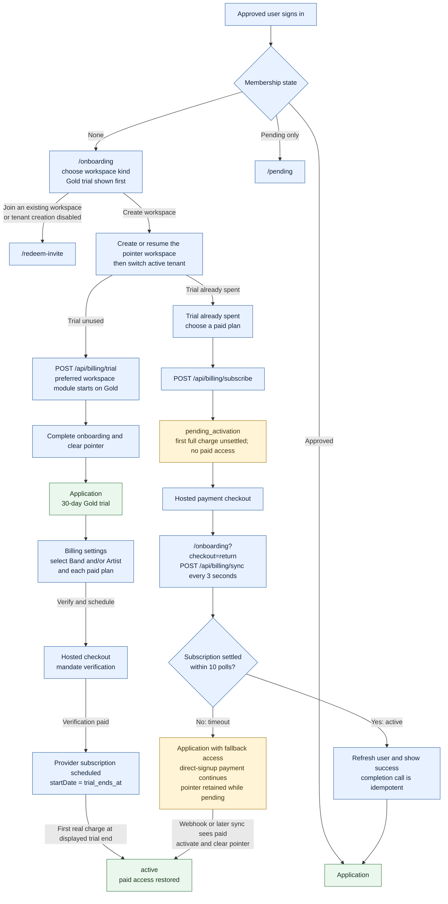
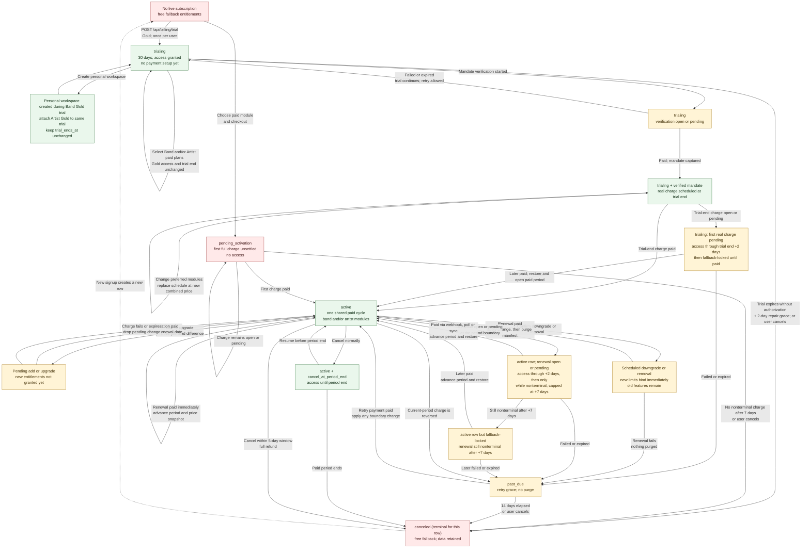

# Subscription lifecycle

States: `trialing` → `active` ⇄ `past_due` → `canceled`, plus
`pending_activation` for a subscription whose first charge has not settled.

## Onboarding, trial selection and scheduled payment



Onboarding now honors the advertised trial before showing paid subscription
choices. It creates or resumes the pointer workspace, starts Gold for that
workspace's product, completes onboarding and clears the pointer without asking
for payment details. Billing settings then exposes the preferred module set:
Band, Artist, or both, including Band Silver as a paid-period choice. Trial
entitlements remain Gold until the first paid period actually begins.

Paid continuation follows
[ADR 001](../architecture-decisions/001-trial-mandate-verification.md). The
direct paid route remains available only for a customer whose trial is already
spent; its checkout-timeout recovery still clears `onboarding_tenant_id`
transactionally when the delayed payment settles.

## Billing lifecycle at a glance



The colors describe ordinary access at the subscription level: green grants
access, yellow is a transition whose exact access is time- or module-dependent,
and red is fallback-locked. The entitlement resolver, not the scheduler,
enforces the trial, paid-period and retry bounds on every read.

## Soundness assessment

The core payment state machine has the right safety properties: no paid access
before an authoritative payment, a held renewal can restore through the same
idempotent ingestion funnel, cancellation never purges data, and `canceled` is
terminal so a refund cannot resurrect the row. Period-end cancellation also
locks at the exact boundary without relying on the scheduler, and resume is
allowed only before that boundary. Checkout timeout recovery is self-healing:
pending payments remain resumable, while eventual activation atomically clears
the onboarding pointer.

The onboarding, trial, delayed first charge, cancellation and checkout recovery
paths are sound: the trial starts before paid choices are shown, the mandate
verification cannot activate a paid period, the provider schedule starts at the
displayed trial end, and only an authoritatively paid recurring charge activates
the first paid period. A held first charge can restore through the same
idempotent ingestion funnel after access has been time-locked.

One edge still prevents asserting the entire lifecycle as sound:

1. **Access can become non-monotonic after a very long renewal hold.** The
   resolver fallback-locks an `active` subscription after the nonterminal
   payment reaches the +7-day cap. If that payment later becomes terminal,
   ingestion sets `past_due_since` at that later time and the `past_due`
   resolver grants a new 14-day window. If +7 days is intended as a hard cap,
   that transition must preserve the earlier boundary instead of reopening
   access.

## Trial

```
POST /api/billing/trial { audience }
```

- **30 days**, **once per customer** — sampling either product spends it.
- **Gold only.** The tier is chosen by the `is_trial_tier` flag on the plan, one
  per ladder, never by slug: slugs are admin-editable and have already drifted
  in production once.
- **One starter module.** A second may be added during the trial at no cost, and
  it does **not** extend the trial.
- **Personal workspace joins a Band trial automatically.** Creating a personal
  workspace while Band Gold is trialing attaches Artist Gold to the same
  subscription and preserves the original `trial_ends_at`. Artist access stays
  Gold through that boundary regardless of the paid plan selected for later.
- **No payment is needed to start.** A provider customer, mandate and schedule
  appear only when the customer later chooses to schedule paid continuation.
- The preferred paid module set can be **Band, Artist, or both**. Band Silver is
  a valid paid-period choice while current trial access remains Gold. A choice
  can change during the trial without extending it; a verified schedule is
  repriced and replaced at the new combined amount.

Access is granted immediately. The entitlement resolver bounds it at
`trial_ends_at + 2 days`, so it ends on time whether or not the scheduler runs.

## Conversion

Trial continuation follows
[ADR 001](../architecture-decisions/001-trial-mandate-verification.md), the
single source of truth for the verification amount, timing and state boundary.

```
POST /api/billing/checkout { interval }
```

The resulting scheduled charge follows ordinary recurring-payment ingestion:
when paid, it opens the paid period from `paidAt`, anchors the withdrawal window
and changes the state to `active`. Open or pending settlement remains
recoverable; access is bounded by the trial resolver and is restored if that
charge pays later.

`POST /api/billing/subscribe` is the direct paid-signup route for a customer
whose trial is already spent. It creates `pending_activation` and takes the
first full-period conversion payment immediately; it does not use the delayed
trial schedule.

## Active cycle

### Adding or upgrading a module

```
POST /api/billing/modules/preview { audience, planId }   → { snapshot, prorationCents }
POST /api/billing/modules         { audience, planId }
```

Activate-first, in three steps:

1. The new configuration is written as **pending** state and committed.
2. An on-demand charge is created for the **prorated positive difference** —
   the delta in proportion to the time left in the period already paid for.
3. On paid, the module lands and the new snapshot is installed. **The renewal
   date does not move**: the customer paid only for the remainder of the period
   they already had.

If the charge fails terminally the pending change is dropped and nothing was
granted. If a bundle discount makes the larger configuration *cheaper*, nothing
is owed and the change applies immediately — the lower price arrives at renewal.

Whether a change is a downgrade is decided by **entitlement shape**, never by
price, precisely because a discount can make "more" cost less.

### Renewal

The provider schedule charges `next_total_cents`. On paid, ingestion advances
the period, installs the next-period snapshot as the current one, re-anchors the
withdrawal window, and applies any module change scheduled for the boundary.

Advance notices go out at **T-7** and **T-1**. Both quote the renewal *date* and
*amount* rather than a relative number of days, because the sweep window is wide
and a relative number would be wrong for most of the rows it catches.

### Downgrading or removing a module

```
POST /api/billing/downgrade/preview { audience, planId | remove }
POST /api/billing/downgrade         { audience, planId | remove, confirmation }
```

Type-to-confirm, validated server-side. On confirmation the purge manifest and
limits snapshot are frozen on the module row. From that moment the customer
**cannot grow past the new limits**, while the features they still pay for
remain granted.

The change lands at the period boundary, when the next renewal is paid — and
only then does anything get deleted. A failed renewal leaves the subscription
`past_due` with **nothing purged**: they never received the lower tier.

On a trial there is nothing paid for to honour, so the change and its purge are
immediate.

## Cancellation

- **Default**: `cancel_at_period_end`. Access runs to the end of the paid
  period, no refund. Resume clears it.
- **Within five days of the cycle-opening charge**: immediate cancellation with
  a **full refund** of that charge. See [`refunds.md`](refunds.md).
- Either way **nothing is deleted.** Access falls back to the free floor of each
  ladder and the data stays.

## What the scheduler does — and does not do

Every reconciliation task is **repair-only**. The entitlement resolver enforces
all time bounds itself on read, so access is correct even if the scheduler never
runs. The tasks flip durable status, settle in-flight charges, finish sagas,
keep the next-period price in step with the discount catalog, and send the
renewal notices — which are messages, not state.

## Provider adapters and operation replay

The services and repositories behind this are diagrammed in
[`billing-operations.md`](billing-operations.md).

Application services only use the `PaymentProvider` port. Its Mollie adapter
uses `mollie-api-typescript` and `PLATFORM_MOLLIE_API_KEY`. SDK retries are
disabled so the durable billing-operation retry policy remains the single
retry owner.

Every provider mutation stores a versioned, provider-neutral command before it
runs. A short database lease prevents concurrent workers from issuing it, and
the same idempotency key is passed to the provider on every attempt. Provider
success and its normalized result are persisted before the idempotent local
completion step. The scheduler therefore repairs both crash windows: before or
during the remote request, and after provider success but before local linkage.
Retryable failures use bounded exponential backoff. Pre-migration rows without
a command are never guessed at; they remain visible as operator warnings.

The super-admin operations pages are read-only views over this durable local
state. They surface terminal/retrying operations, the oldest pending operation,
unresolved webhook failures, and local subscription/payment drift signals.
Opening a dashboard never calls Mollie. Platform webhook attempts are recorded
in `billing_webhook_events`; a failed attempt is resolved when a later attempt
for the same subscription and provider payment is processed.
